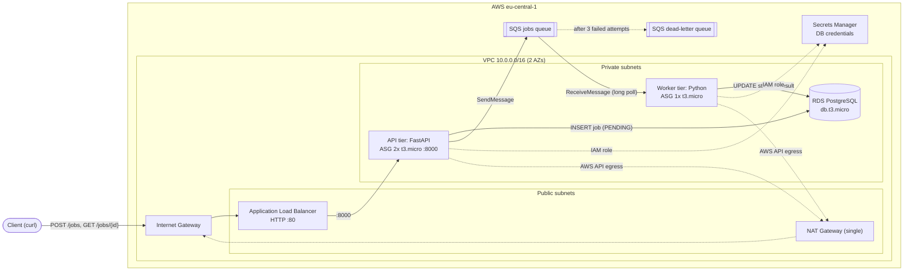

# aws-job-processor

Event-driven, three-tier job processing platform on AWS, fully provisioned with Terraform and delivered through GitHub Actions.

Clients submit jobs (e.g. report generation) to a REST API. The API stores each job in PostgreSQL and publishes a message to SQS. A background worker consumes the queue, processes the job asynchronously and records the result. Clients poll for the job status by ID.

## Architecture

## Features

- **Async processing**: the API responds immediately with `202 Accepted`. The work runs in a separate worker tier fed by SQS, with a dead-letter queue for failed jobs.
- **Network isolation**: only the ALB is public. The API, worker and database run in private subnets across 2 AZs, with NAT for outbound traffic.
- **Least-privilege IAM**: each tier has its own instance role. DB credentials are managed by RDS in Secrets Manager, so there are no secrets in code or Terraform state.
- **No SSH**: instances are reached through SSM Session Manager. There are no key pairs and no bastion, and port 22 is closed.
- **Modular Terraform**: `vpc`, `alb`, `app`, `worker`, `db` and `queue` modules are composed per environment. Remote state lives in S3 with native locking.
- **CI/CD**: GitHub Actions runs `fmt`, `validate` and `plan` on every push. `apply` is triggered manually and gated by an environment approval.
- **Cost-aware**: t3.micro / db.t3.micro, a single NAT Gateway and single-AZ RDS. The platform is built for short apply → test → destroy cycles (< 2 h, < $1).

## API

| Method | Path         | Description                                   |
|--------|--------------|-----------------------------------------------|
| POST   | `/jobs`      | Create a job, returns its ID (`PENDING`)      |
| GET    | `/jobs/{id}` | Get job status (`PENDING` → `PROCESSING` → `COMPLETED`/`FAILED`) and result |
| GET    | `/health`    | Load balancer health check                    |

## Quickstart (high level)

1. Bootstrap remote state (once): `./scripts/bootstrap-state.sh`
2. Deploy: `cd environments/dev && terraform init && terraform apply`
3. Test: `curl -X POST http://<alb_dns>/jobs ...` then `curl http://<alb_dns>/jobs/<id>`
4. Destroy: `terraform destroy -auto-approve`

> Coming soon: detailed quickstart, trade-offs, cost notes, CV bullets and interview talking points.
